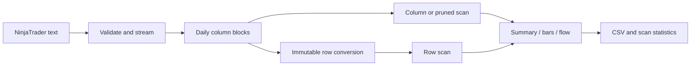
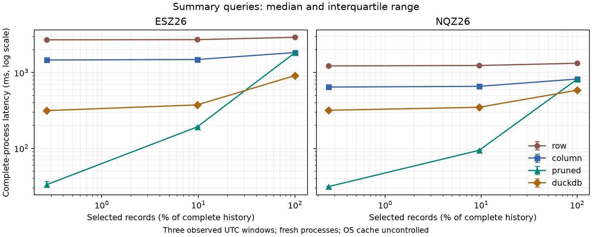

# lattice-market

[](https://github.com/DanielPastor05/lattice-market/actions/workflows/ci.yml)

A C++20 streaming columnar engine for NinjaTrader tick analytics, with exact
quarter-point prices, nanosecond timestamps and reproducible data imports.

This project explores the software engineering behind market data: parsing,
binary storage, integrity checks, block pruning and query correctness. It
currently supports the December 2026 E-mini S&P 500 (`ESZ26`) and E-mini
Nasdaq-100 (`NQZ26`) contracts. These are fixed contracts; the engine does not
construct continuous futures series.

## Working today

- Stream NinjaTrader text exports into daily UTC columnar partitions.
- Preserve original row order, duplicate records and seven fractional digits.
- Store six independent 64-bit columns in blocks of up to 65,536 records.
- Validate headers, directories and accessed payloads with IEEE CRC32.
- Compute summaries, OHLCV bars and estimated buy/sell/unknown flow.
- Compare an interleaved row baseline, full column scans and timestamp-based block pruning.
- Publish immutable imports with a SHA-256 source fingerprint and manifest.
- Check queries against an independent Python `Decimal` reference.
- Compare queries against an independently imported, pinned DuckDB baseline.

The implementation is single-threaded, uncompressed and uses standard C++ and
Python libraries. There is no database server, API key or live trading account.
VWAP uses compensated floating-point accumulation; prices, volumes, counts and
timestamps retain their integer representation. A source row identifies an
export record, not a unique exchange execution.



## Build

Requirements: a modern C++20 compiler with calendar support (MSVC 2022,
GCC 12+ or Clang with a compatible standard library), CMake 3.20+, Python 3.11+.

Linux/macOS, with a compatible compiler:

```sh
cmake -S . -B build -DCMAKE_BUILD_TYPE=Release
cmake --build build --parallel 2
ctest --test-dir build --output-on-failure
python tools/demo.py --lattice build/lattice
```

Windows PowerShell with Visual Studio 2022 C++ tools:

```powershell
cmake -S . -B build -G "Visual Studio 17 2022" -A x64
cmake --build build --config Release
ctest --test-dir build -C Release --output-on-failure
python tools/demo.py --lattice build/Release/lattice.exe
```

If CMake is not on PATH, Visual Studio's bundled copy is usually located under
`Common7/IDE/CommonExtensions/Microsoft/CMake/CMake/bin`. Run the same commands
using its absolute path. The local initial build was tested with MSVC
19.43.34809 and Python 3.14.4 on Windows. The repository includes Linux,
Windows and sanitizer CI configurations. Release checks passed on Ubuntu and
Windows, and sanitizer checks passed on Linux/Clang (ASan + UBSan) and MSVC
(ASan) in [the initial published CI run](https://github.com/DanielPastor05/lattice-market/actions/runs/37337662759).
The synthetic demo creates its own temporary input and removes it
when finished, so a clean checkout works without proprietary data.

## Import your exports

Each source line must use this format:

```text
20260909 220006 0680000;7713.5;7713.5;7714;1
```

The fields are `UTC timestamp;last;bid;ask;volume`. Decimal prices must be exact
multiples of 0.25, and last price and volume must be positive. LF and CRLF are
accepted. Invalid dates, extra fields, oversized lines and decreasing
timestamps stop the import with a filename and line number. Equal timestamps
and identical rows are deliberately retained.

```powershell
python tools/import_dataset.py --lattice build/Release/lattice.exe `
  --input "C:/Users/pasto/OneDrive/Documents/Proyectolattice/ES 12-26.Last.txt" `
  --contract ESZ26 --data data
python tools/import_dataset.py --lattice build/Release/lattice.exe `
  --input "C:/Users/pasto/OneDrive/Documents/Proyectolattice/NQ 12-26.Last.txt" `
  --contract NQZ26 --data data
```

The Python wrapper hashes the source before and after import, checks its file
identity, and publishes a completed contract directory only after validation.
It refuses an existing destination. On failure it removes only the staging
directory it created. The C++ `import` command is an internal staging operation;
use the wrapper for normal imports. Source exports are neither edited nor
copied into the repository. Raw and derived market data are ignored by Git.

Create immutable row baselines from the published column stores:

```powershell
python tools/import_dataset.py --lattice build/Release/lattice.exe `
  --row-source data --contract ESZ26 --data data-rows
python tools/import_dataset.py --lattice build/Release/lattice.exe `
  --row-source data --contract NQZ26 --data data-rows
```

Conversion preserves values, record order and every block boundary. The row
manifest retains text-import provenance and adds parent manifest/partition
hashes plus the conversion command. It leaves the column store intact.

## Query

All intervals are `[from, to)` in UTC. The following PowerShell command produces
a one-hour summary; replace `summary` with `flow` for estimated classifications:

```powershell
build/Release/lattice.exe query summary --data data --contract ESZ26 `
  --from 2026-09-10T14:00:00Z --to 2026-09-10T15:00:00Z
build/Release/lattice.exe query bars --data data --contract NQZ26 `
  --from 2026-09-10T14:00:00Z --to 2026-09-10T15:00:00Z `
  --bucket 1m --scan-mode pruned --output bars.csv --stats scan.json
build/Release/lattice.exe verify --data data --contract NQZ26
```

Buckets are `1s`, `1m`, `5m`, `1h` and `1d`, aligned to the UTC epoch. Empty
buckets are omitted. Edge buckets include only selected records. Open and close
follow source order, including equal timestamps. Summaries with no selected
records return zero counts and blank prices/VWAP. Empty flow fractions are
blank rather than zero. CSV uses a decimal point independent of local language.

For flow, a record is estimated buy when `last == ask` and estimated sell when
`last == bid`, only if `0 < bid < ask`. Everything else is unknown, including
locked/crossed quotes and inside/outside prices. This is a quote-based estimate,
not confirmed aggressor side. Quotes are not forward-filled.

`--scan-mode column` reads required columns from every block. The default
`pruned` mode skips blocks outside the interval after validating their directory.
`--scan-mode row --data data-rows` scans the row baseline without pruning. It
reads/CRC-checks entire 48-byte records and decodes the query's required fields.
Mixing a scan mode and an incompatible storage layout is an error.
`--stats` reports requested bytes, decoded/selected rows, examined/skipped
blocks and elapsed time. Requested bytes are application reads, not physical
disk traffic. `verify` checks every column, including payloads skipped by queries.

## Correctness and next milestones

The integration suite includes 100 ns range boundaries, invalid source records,
duplicate preservation, midnight and block transitions, deterministic randomized
queries, volume overflow, corrupt checksums and invalid offsets. Floating-point
VWAP comparisons allow `max(1e-8, abs(expected) * 1e-12)` error; flow fractions
allow `1e-12`. The reference reads text directly and uses `Decimal`, without
calling the binary reader or the production query code.

The initial local validation imported and verified all 24,804,094 supplied ES/NQ
records. Twelve selected-window comparisons against the independent text
reference passed; see the validation ledger for the exact coverage and counts.

## DuckDB comparison and reproducible measurements

The benchmark dependency is optional; the C++ engine and synthetic demo still
need no packages. From the project directory, use an isolated Python environment:

```powershell
python -m venv .venv
.venv/Scripts/python.exe -m pip install -r tools/requirements-bench.txt
.venv/Scripts/python.exe tests/test_duckdb.py build/Release/lattice.exe
.venv/Scripts/python.exe tools/duck_baseline.py prepare `
  --database data/baseline.duckdb --data data --lattice build/Release/lattice.exe `
  --source-dir "C:/Users/pasto/OneDrive/Documents/Proyectolattice"
.venv/Scripts/python.exe tools/benchmark.py --lattice build/Release/lattice.exe `
  --data data --row-data data-rows --database data/baseline.duckdb `
  --source-dir "C:/Users/pasto/OneDrive/Documents/Proyectolattice" --output results/new-run
```

On Linux, use `.venv/bin/python` and `build/lattice`. Database preparation refuses
an existing database, so reuse the prepared file for reruns. Measurements refuse
an existing output directory. The optional CMake `LATTICE_BENCH_TESTS=ON` option
adds DuckDB checks to CTest when its selected Python has the pinned package.

The baseline independently parses the original text, preserving integer ns,
quarter-point prices, source order and volumes. The harness checks full-text
Decimal summaries and all query outputs before timing. It rotates four CLI
variants across two warmups and seven measured repetitions for 24 fixed workloads.
Every invocation creates a fresh process; DuckDB also opens a fresh connection.
OS cache is uncontrolled. Raw samples, source/binary hashes and environment
metadata accompany median/min/max/IQR summaries. See [performance](docs/PERFORMANCE.md)
for timing boundaries, integrity costs and results. No general speedup is assumed.

Current engine 0.2.0 results: complete-process medians in milliseconds,
seven measured samples each, fresh processes and uncontrolled OS cache.

| Contract | Summary window | Row | Column | Pruned | DuckDB |
| --- | --- | ---: | ---: | ---: | ---: |
| ESZ26 | Full history | 2918.82 | 1837.72 | 1835.47 | 912.98 |
| ESZ26 | Ten minutes | 2706.41 | 1464.32 | 33.06 | 314.62 |
| NQZ26 | Full history | 1326.78 | 821.39 | 815.40 | 584.06 |
| NQZ26 | Ten minutes | 1224.25 | 643.99 | 31.25 | 317.74 |



Points represent three observed UTC windows; error bars show the interquartile
range. These compare complete tools, including their startup, read, integrity
and compression costs. Full results and raw samples are linked in the performance
report. All 864 invocations (192 warmups, 672 measured) passed output comparisons.

## Memory and sanitizer checks

Windows Release and MSVC AddressSanitizer checks passed locally. To build the
instrumented engine (requires the compiler's ASan component):

```powershell
cmake -S . -B build-asan -G "Visual Studio 17 2022" -A x64 -DLATTICE_ASAN=ON
cmake --build build-asan --config RelWithDebInfo
ctest --test-dir build-asan -C RelWithDebInfo --output-on-failure
python tools/fuzz_reader.py --lattice build-asan/RelWithDebInfo/lattice.exe `
  --cases 256 --report mutation-rerun.json
```

On GCC/Clang, `LATTICE_ASAN=ON` enables ASan and UBSan. Windows MSVC enables
ASan only. The mutation runner uses bounded deterministic CLI cases; it is not
a coverage-guided fuzzer. The local 256-case campaign passed without sanitizer
reports or unexpected exits.

A 24M-record synthetic fixture with more than 1 GiB of record payload passed
nine queries under an enforced 256 MiB Windows committed-memory cap. Peak
working set stayed below 8 MiB. The fixture and reproduction commands are in
[validation](docs/VALIDATION.md); Windows commit/working-set evidence does not
establish Linux RSS limits or importer memory bounds.

An optional `LATTICE_FUZZ=ON` Clang target exercises the production binary reader,
JSON reader and source-line parser with libFuzzer. It checks raw bytes and an
independent CRC-repaired path, bounded to 4 MiB. Synthetic seeds include both
layouts and short multi-block files. CI now also schedules a Release Linux
memory-cap check; execution evidence for these new jobs is pending the next push.
See the commands and limits in [validation](docs/VALIDATION.md).

The 1M/10M/100M timing series remains pending. Windows evidence uses a committed
memory cap; the Linux runner uses `RLIMIT_AS` and reports each child's peak RSS
separately.

See [binary format](docs/FORMAT.md), [design and limits](docs/DESIGN.md),
[data provenance](docs/DATA.md) and [validation results](docs/VALIDATION.md).
The MIT license covers this code; it does not grant market data redistribution
rights.

Implementation and documentation were developed with Codex assistance. The
validation ledger records executed checks and remaining work.
